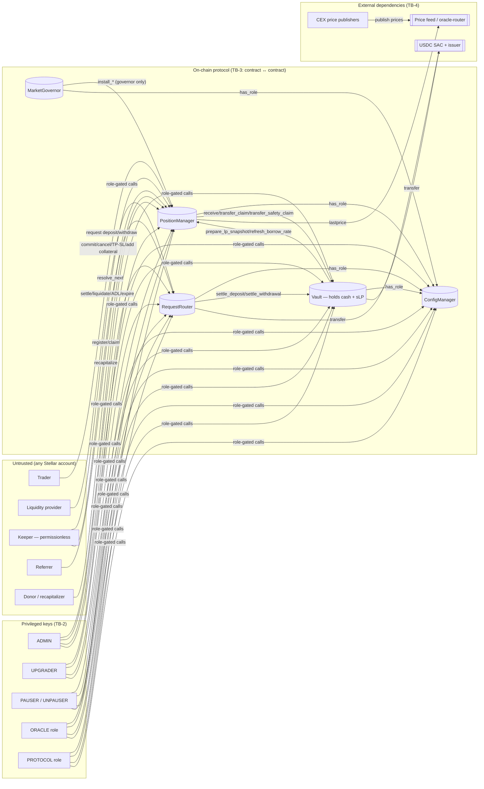

# WinTrader Contracts — STRIDE Threat Model

| | |
|---|---|
| **Scope** | `contracts/{config-manager,position-manager,vault,request-router,shared}` (~10.6k LOC Soroban/Rust, `soroban-sdk 23.5.2`) plus the deploy/upgrade scripts in `scripts/` |
| **Commit** | Modelled at `48c846e`; every finding re-checked at the audit tag `audit-2026-10-06` (branch `fix/review-findings`). See §9 and `docs/audit/`. |
| **Line references** | Point at `48c846e` unless a row says otherwise |
| **Date** | 2026-10-04 |
| **Purpose** | Pre-audit threat model: give auditors the system's trust boundaries, privileged surfaces, and the highest-risk areas to focus on, and list what to fix before handing over the code |
| **Method** | Manual review of all contract sources against STRIDE, per component and per trust boundary. The spec in `docs/design/trading-fees-and-settlement-specification.md` was used for intended behaviour. |

> This is a design-level threat model, not an audit. Findings marked *Confirmed* were verified against the code. Findings marked *Design/Residual* are intended behaviour that still carries risk and should be disclosed to auditors and users.

---

## 1. System overview

WinTrader is a perpetual-futures DEX. Liquidity providers deposit a single collateral asset (USDC, 7 decimals) into a vault and act as counterparty to all traders. Traders open leveraged long and short positions against oracle prices. Every trader action uses two phases: the trader **commits** the order, and after an execution delay a permissionless **keeper** **settles** it at a fresh oracle price.

| Contract | Role | Holds funds? |
|---|---|---|
| **ConfigManager** | Root of trust: role registry (ADMIN, UPGRADER, PAUSER, UNPAUSER, ORACLE, PROTOCOL), two-step admin transfer, global upgrade timelock | No |
| **MarketGovernor** | Owns configuration *changes*: proposals, timelocks, the conservative fast path, pending proposals. Installs into the PM, which is the only contract that accepts it. Added in `10c845d`. | No |
| **PositionManager (PM)** | Accounting ledger: markets, positions, pending actions, fee and funding indices, risk states, the live configuration, and the non-LP claim buckets. Directs every cash movement. Since `10c845d` it accepts configuration only from the MarketGovernor and re-validates it. | No (directs the vault) |
| **Vault** | Holds all collateral cash and issues the LP share token (`sLP`, SEP-41). Moves cash only on PM or router instruction. Prices LP shares from the PM snapshot. | **Yes — all protocol cash** |
| **RequestRouter** | FIFO queue for delayed LP deposits and withdrawals. Escrows assets and shares while requests are pending, and holds LP payouts that could not be delivered. | Yes (in-flight LP escrow) |
| **Price feed** (external, `oracles` repo) | SEP-40 `lastprice(symbol)` and `decimals()`. Called "oracle-router" in deployments. | No |

### 1.1 Data-flow diagram and trust boundaries

| ID | Trust boundary | What crosses it | Primary control |
|---|---|---|---|
| TB-1 | Untrusted account → protocol entrypoints | Orders, LP requests, keeper settlements, referral ops | `require_auth` on the owner or caller; input validation; commit→settle delay with fresh-price rule |
| TB-2 | Privileged key → protocol | Role-gated config, pause, upgrade, revenue claim | ConfigManager roles; timelocks on *some* paths (see §5) |
| TB-3 | Contract → contract | Cash instructions (PM→Vault), LP settlement (Router→Vault→PM), role checks (*→CM) | Callee checks the stored caller address plus `require_auth`; addresses are set once |
| TB-4 | Protocol → external dependency | Prices; token transfers | Staleness and positivity check on price; decimals check on the feed and asset; `try_transfer` with fallback to a claim |
| TB-5 | Operator tooling → chain | Deploy, wiring, role grants, upgrades | `scripts/*.sh` and keys in the local `stellar` CLI store |

---

## 2. Assets

| ID | Asset | Location | Impact if compromised |
|---|---|---|---|
| A1 | Vault cash (LP capital + all trader collateral + escrow + claims) | Vault token balance | Total loss |
| A2 | Integrity of the LP share price (NAV) | `snapshot::build_snapshot` → vault share maths | Value transfer between LP cohorts |
| A3 | Trader position state and collateral | PM persistent `Position(id)` | Wrongful liquidation, theft, or locked funds |
| A4 | Non-LP claim buckets (escrow, protocol, referral, unclaimed payouts, receiver funding) | PM `Ledger` (instance storage) | Mis-accounting of which cash belongs to LPs |
| A5 | Price-feed address and price integrity | PM `PriceFeed`, external oracle | Arbitrary PnL and liquidations |
| A6 | Role assignments and admin key | ConfigManager | Escalation to everything above |
| A7 | Contract code (WASM) | Each contract's upgrade path | Total loss |
| A8 | Protocol liveness: settlement, liquidation, LP queue | All | Bad debt, frozen funds |
| A9 | Event stream consumed by the indexer and keepers | Contract events | Wrong off-chain state, missed liquidations |

---

## 3. Actors and privilege matrix

| Actor | Trust | Capabilities | Timelocked? |
|---|---|---|---|
| Trader | Untrusted | Commit and settle-own orders, cancel limit orders, TP/SL, add collateral, claim deferred payouts | — |
| LP | Untrusted | Queue deposits and withdrawals, transfer `sLP`, claim deferred LP payouts | Delay `lp_request_delay_seconds` (default 24h) |
| Keeper | Untrusted, economically motivated | All settlements, liquidation, ADL, expiry cleanup, LP resolution, index checkpoints, applying due proposals | — |
| **ADMIN** (CM) | Highly trusted | Grant or revoke every role except ADMIN; propose admin; set upgrade timelock; global and market config and market deregistration (through the MarketGovernor); `set_vault` / `set_request_router` (once); **vault `set_lp_config`** | Role grants: **no**. Upgrade-timelock change: **no**. Config: yes, except "conservative" changes and brand-new markets (re-registration is timelocked since `10c845d`). LP config: **no** |
| **UPGRADER** | Highly trusted | Propose **and** execute WASM upgrades; `migrate` | Yes (CM: ≥1 day; others: `max(CM timelock, config_timelock)`, default 2 days) |
| PAUSER | Trusted | Pause PM and vault, disable markets, **cancel upgrades** | No (by design) |
| UNPAUSER | Trusted | Unpause, enable markets | No |
| ORACLE | Trusted | Propose and cancel price-feed replacement (through the MarketGovernor; ADMIN can also cancel) | Yes (`config_timelock_seconds`) |
| **MarketGovernor** (contract) | Trusted by the PM | Install global/market config and price feed into the PM; deregister markets | Its own proposals are timelocked; its upgrade delay is `max(CM timelock, config_timelock)` |
| PROTOCOL | Trusted | `claim_protocol` to any recipient, up to `protocol_claimable_total` | No |
| Price publishers | **Fully trusted, implicitly** | Set every price the protocol uses | No |
| USDC issuer | External, trusted | Freeze or deauthorize the vault's balance | — |

---

## 4. Assumptions

1. The collateral asset is the Stellar Asset Contract (SAC) for USDC. Transfers have no receiver hooks, so `try_transfer` cannot be budget-griefed by a recipient. The vault constructor only checks `decimals == 7` (`vault/src/contract.rs:155`).
2. Soroban forbids contract re-entrancy. Any accidental re-entrant path traps (a liveness failure) rather than creating a theft window.
3. Archived persistent entries are restored automatically (Protocol 23 / CAP-66), so TTL expiry of a `Position` or `Request` costs a fee but does not lose state.
4. Privileged roles are held by separate keys, and ADMIN and UPGRADER are multisig accounts. This is **not enforced on-chain**. Since `eba596b`, `deploy.sh` refuses a mainnet deploy unless every role has a non-admin holder and UPGRADER ≠ PAUSER; multisig is still a convention.
5. The external price feed returns `price` with 7 decimals and stamps `timestamp` honestly. The protocol cannot detect a publisher who lies about either.

---

## 5. STRIDE analysis

Severity reflects likelihood × impact for a mainnet deployment holding meaningful TVL.

### 5.1 Spoofing

| ID | Threat | Existing mitigations | Residual / gap | Severity |
|---|---|---|---|---|
| S-1 | Acting as another trader or LP (closing their position, cancelling, claiming payouts) | Every owner path calls `owner.require_auth()` on the **stored** owner (`trigger.rs:34`, `mutation.rs:21,98`, `entry.rs:506`, `requests.rs:40`) | None found | Low |
| S-2 | Impersonating PM or router to make the vault move cash | `require_pm` / `require_router` compare the caller with the stored address **and** `require_auth` (`vault/src/contract.rs:37-51`) | Holds provided the addresses were wired correctly at deploy (see T-15) | Low |
| S-3 | Impersonating the vault to call `prepare_lp_snapshot` / `refresh_borrow_rate` with a forged `physical_cash` | `require_vault` (`position-manager/src/auth.rs:23`) | None | Low |
| S-4 | Redirecting a keeper reward to an address that did not do the work | `keeper.require_auth()` on every settlement, so the reward goes to the signer | None | Info |
| S-5 | **Spoofed or manipulated price data** | Price must be `> 0`, `timestamp ≤ now`, and `now − timestamp ≤ max_price_age_seconds` (`snapshot.rs:11-29`); feed decimals checked on propose and apply | **No deviation bound, confidence check, TWAP, or second source inside the protocol.** The publisher sets `timestamp`, so freshness is self-attested. A compromised publisher key or oracle-router can mint arbitrary PnL, liquidate any position, or drain the vault through a winning position. **→ T-01** | **Critical** |
| ~~S-6~~ | *Retired: the referral program was removed in `5fad1d6`.* Referral self-referral through a sybil address | `referrer != trader` check (`referral.rs:62`) | Sybils get up to `referral_fee_share_bps` (2.5%) of their own fees back. Accepted by design. | Info |

### 5.2 Tampering

| ID | Threat | Existing mitigations | Residual / gap | Severity |
|---|---|---|---|---|
| T-a | Arithmetic overflow or rounding exploitation | Checked i128 maths, U256 intermediates, `overflow-checks = true` in release, explicit floor/ceil direction (`shared/src/math.rs`), conformance vectors for `exp2`/`log2` | Auditors should fuzz rounding direction across waterfall steps (`settle.rs`, `fees.rs`) for dust extraction | Medium (audit focus) |
| T-b | First-depositor / share-inflation attack | Virtual offsets `SHARE_OFFSET = 1e6`, `NAV_OFFSET = 1` (`vault/src/contract.rs:20-21`); deposits delayed 24h; minimum deposit > resolve reward | Mitigated | Info |
| T-c | Latency arbitrage: committing after seeing a CEX move and filling at a stale oracle price | Fill must use an observation **strictly after** both the commit-time observation and `created_at` (`action.rs:12-15`), plus an execution delay | Effective, but see T-09 on settlement timing | Low |
| T-d | **Settlement timing chosen by the settler.** Settlement is permissionless, so a trader can act as their own keeper and choose *which* fresh sample fills them within `[execute_after, expires_at)` (≤ 300s for market opens). Increase, decrease and close actions have **no expiry**. With `acceptable_price = 0` they can be filled arbitrarily late. | Fresh-price rule; competing keepers | The safety of "binding" market orders depends on honest keepers settling promptly. **→ T-09** | Medium |
| T-e | **Keeper-chosen ADL victim.** Any profitable position on a side in ADL or HardCap can be closed in full; the contract enforces no ordering (`adl.rs:11-58`) | ADL is gated on side state and positive PnL; no closing fee | A keeper can target specific traders, such as competitors or the most profitable positions, out of a fair order. **→ T-09** | Medium |
| T-f | **Funding-rate manipulation.** `instant_weight_bps` (default 30%) mixes live skew into the funding integral (`math.rs:136`) | EMA half-life of 12h; `min_position_lifetime` (60s); opening fees; OI caps | A large, short-lived one-sided position moves the rate paid by every position on that side. Auditors should model the cost against the gain. | Medium (economic) |
| T-g | **Asymmetric NAV.** `vault_nav = cash_lp_equity − Σ positive side PnL` (`snapshot.rs:53-98`). Sides with net losses, and accrued but uncollected borrow and funding owed by positions, are ignored. | Deliberately conservative toward withdrawals; `min_deposit_nav_factor_bps` gate | Deposits are priced **below** fair value when traders are net losing. Depositors who time requests around large unrealized trader losses capture value from existing LPs. Anyone may resolve the queue head, so the resolver also picks the snapshot moment. **→ T-12** | Medium (economic) |
| T-h | Donation or `recapitalize` changing utilization and the borrow rate | Donations are an irreversible gift to LPs; Soroban has no same-transaction flash-loan composition with delayed deposits | Low | Low |
| T-i | Tampering with config through "conservative" fast paths | `global_is_conservative` only allows lowering `risk_capacity_limit_bps`; `market_is_conservative` only allows tightening caps or margin (`governance.rs:11-33`) | Correctly narrow. **But** new markets and **re-registered (previously deregistered) markets** bypass the timelock entirely (`contract.rs:361-367`). A pending limit order on a deregistered symbol can then fill under fees or margins that never went through a timelock. **→ T-04** | Medium |

### 5.3 Repudiation

| ID | Threat | Existing mitigations | Residual / gap | Severity |
|---|---|---|---|---|
| R-1 | Privileged actions without an audit trail | Events for role changes, config proposals, apply and cancel, pause, upgrade propose and cancel, price-feed changes, protocol claims | `set_vault` and `set_request_router` emit no events; `migrate` emits none | Low |
| R-2 | **Events published for state that is never persisted.** In paths that return `RequiresLiquidation`, the contract has already run `borrow::accrue`, `funding::accrue` and `risk::evaluate_market_risk`. These emit `BorrowCheckpoint`, `FundingCheckpoint` and `RiskStateChanged`, and then the function returns successfully **without saving** the ledger or market (`trigger.rs:143-161`, `adl.rs:47-58`, `mutation.rs:240-267`). | — | The indexer and keepers (the `KeeperWorld`) see index checkpoints and risk-state transitions that never happened on chain. This could mislead ADL and liquidation decisions and the LP-view NAV. **Fixed in `e077d2d`:** these returns now persist the accrual through `action::persist_accrual`. **→ T-08** | ~~Medium~~ **Fixed** |
| R-3 | Trader disputes a fill price | `ActionSettled` carries `price` and `observed_at`; the commit carries `commit_observed_at` | Good | Info |

### 5.4 Information disclosure

All on-chain state is public; the contracts store no secrets. The relevant threats are off-chain:

| ID | Threat | Severity |
|---|---|---|
| I-1 | Commit transactions are public before settlement. Keepers and MEV searchers can see pending orders and their `acceptable_price`. The fresh-price rule limits what that information is worth. | Low |
| I-2 | **Operator secrets.** `provision-keys.sh` / `deploy.sh` write admin, keeper and oracle-publisher secrets into the plaintext `stellar` CLI identity store and `.env.<network>` files. Leaking the **oracle publisher** key equals S-5 (critical). Oracle-publisher keys are now owned by the oracles repo (`deploy-cex-oracles.sh` removed in `eba596b`); the admin and keeper secrets still live here. | **High** (operational) |

### 5.5 Denial of service

| ID | Threat | Existing mitigations | Residual / gap | Severity |
|---|---|---|---|---|
| D-1 | **LP queue head-of-line blocking.** `resolve_next` must resolve the head before anything behind it (`requests.rs:164-234`). Settlement calls `prepare_lp_snapshot`, which reads a fresh price for **every registered market, including disabled ones** (`snapshot.rs:48-50`). One stale or delisted symbol, an arithmetic panic, or a resource-limit overrun reverts the whole call, and **every LP deposit and withdrawal halts**. There is no skip or escape hatch. | `lp_paused` returns `NotReady` instead of panicking; business rejections return `Failed` and refund | Single point of failure across all LP flows. Deregistering a market requires it to be empty, and closing its positions also needs that market's price. **→ T-02** | **High** |
| D-2 | **Oracle outage freezes exits and liquidations.** Every settle, close, TP/SL and liquidation path needs a fresh price. A stale feed for longer than `max_price_age_seconds` stops liquidations while prices move, so bad debt accrues. | `max_price_age_seconds` is configurable (≤ 1 day) | Inherent; needs runbooks and monitoring. Paired with T-01. | High |
| D-3 | **Instance-storage bloat by PAUSER.** `disable_market` accepts **any** symbol and writes `MarketDisabled(symbol)` into **instance** storage. `enable_market` writes `false` and never removes the entry (`storage.rs:144-155`, `contract.rs:419-429`). Every PM call loads the instance entry, so a compromised or careless PAUSER raises fees for all users and can push the entry toward the ledger-entry size limit, bricking the PM. | — | A "reversible-only" role gained an irreversible DoS. **Fixed in `e077d2d`:** only configured markets can be disabled, and enabling removes the entry. **→ T-06** | ~~Medium~~ **Fixed** |
| D-4 | **Position mutation slot lock.** One pending mutation per position, with no cancel and no expiry (acknowledged in spec §7). If a settle path reverts in a way preflight did not foresee, the action can never terminate and the owner cannot increase, decrease or close. Only TP/SL, liquidation or ADL can exit. | Preflight mirrors settle checks; dust checks at creation; `review_findings.rs` tests | Safety depends on preflight and settle staying in sync. Auditors should differential-test `decrease_preflight` against `settle::settle`. **→ T-10** | Medium |
| D-5 | Market-count scaling. `max_active_markets` has no upper bound (`validation.rs:66`). `prepare_lp_snapshot` and `apply_global` loop over every market, making an oracle call and storage writes per market. | Deploy script defaults to 8 | Must be benchmarked against Soroban CPU, read and write limits; the contract should enforce a ceiling. **→ T-13** | Low–Medium |
| D-6 | A recipient blocks a payout (no trustline, deauthorized, frozen) | `deliver_to_owner` and `deliver_or_hold` use `try_transfer` and fall back to a claimable balance (`ledger.rs:181-197`, `requests.rs:18-37`) | Good | Info |
| D-7 | LP queue spam (many minimum-size requests) | Minimum > `lp_resolve` reward, which is paid out of each request, so spam pays keepers to clear it | Low | Low |
| D-8 | PAUSER repeatedly cancels upgrades, including emergency fixes | ADMIN can revoke PAUSER | Low | Low |
| D-9 | Admin freezes LP withdrawals through `set_lp_config` (for example `max_withdraw_utilization_bps = 0`) with no timelock (`vault/src/contract.rs:359-364`) | Failed withdrawals return the shares | Instant, unannounced change to LP exit terms. **→ T-04** | Medium |

### 5.6 Elevation of privilege

| ID | Threat | Existing mitigations | Residual / gap | Severity |
|---|---|---|---|---|
| E-1 | **UPGRADER can replace any contract's code**, including the vault, and so take all funds | Propose, then a timelock, then execute; PAUSER can cancel; hash pinned at propose time (`shared/src/upgrade.rs`) | The same role proposes and executes. Safety depends entirely on someone watching `UpgradeProposed` events and on PAUSER reacting within the window. **→ T-03** | **High** |
| E-2 | **ConfigManager is the root of trust but has the shortest upgrade delay.** CM uses only its own `upgrade_timelock` (≥ 1 day, `config-manager/src/contract.rs:195-197`); the other contracts use `max(CM, config_timelock)` (default 2 days). A malicious CM upgrade can answer `has_role = true` for an attacker, who then gets **immediate** PROTOCOL claims, pause and unpause, `set_lp_config`, conservative or new-market config, and proposal rights for everything else. | Timelock ≥ 1 day | The root-of-trust contract has the weakest timelock. **→ T-03** | **High** |
| E-3 | ADMIN lowers timelocks. `set_upgrade_timelock` takes effect immediately (down to 1 day). `config_timelock_seconds` only needs to be `> 0` (`validation.rs:71`), so **one** timelocked proposal setting it to 1s makes every later PM config and price-feed change effectively instant. | Each step is evented and the first one is timelocked | A single observable step removed the protection of every later step. **Fixed in `e077d2d`** for `config_timelock_seconds` (floor of 1 day). `set_upgrade_timelock` remains instant but is already floored at 1 day. **→ T-05** | ~~Medium~~ **Fixed** |
| E-4 | ADMIN grants any non-ADMIN role instantly, including UPGRADER, ORACLE and PROTOCOL to itself | ADMIN cannot grant ADMIN; two-step admin transfer with a 7-day expiry; since `eba596b` the mainnet deploy requires a separate non-admin holder for every role and UPGRADER ≠ PAUSER | Separation holds at deploy time only. After that, ADMIN can still re-grant any role to itself instantly. | Medium |
| E-5 | Revoking a compromised ORACLE key does **not** remove its pending price-feed proposal; `apply_price_feed` is permissionless (`contract.rs:151-158`) and cancelling needs the ORACLE role | ADMIN can grant ORACLE to a fresh key, then cancel | Incident runbook must include "grant a new ORACLE, then cancel the proposal". **→ T-07** | Low–Medium |
| E-6 | Calling vault or router internals directly | Address and auth checks (S-2) | None | Low |

---

## 6. Consolidated findings and pre-audit actions

Ordered by priority. Items marked **open** should be resolved, or explicitly accepted in writing, before the audit starts so auditor time goes to unknown issues. Status is as of `b6ffbe8`.

| ID | Title | Sev. | Status | Recommendation |
|---|---|---|---|---|
| **T-00** | PositionManager WASM exceeded the network contract-size limit | Critical | **Fixed** (`03dee9b`…`10c845d`) | Was 148,136 bytes against the 131,072-byte cap. Fixed by removing the `bump_*` entry points, the referral program and position increase; splitting configuration changes into the MarketGovernor; and making four preview/total views test-only. Now **128,027 bytes (3,045 headroom)** with the stellar CLI's bundled optimizer, after the pre-audit fixes, which was chosen over standalone binaryen (that reached 120,567). Headroom is thin: audit fixes that add code to the PM must watch size. `make optimize` and CI fail above the cap and warn below 10 KB of headroom. Verified end to end on a local quickstart network (§9.1). |
| **T-01** | The price feed is fully trusted; no in-protocol sanity bounds | Critical | Design/Residual (accepted, K-1) | Production uses a third-party SEP-40 provider; the in-repo oracle is test-only and out of scope. The PM checks positivity, future stamps, and age only. Configure `max_price_age_seconds` and `max_market_order_lifetime` above the provider's resolution plus lag, register market symbols exactly as the provider's tickers, and monitor the feed. Consider deviation bounds or a second source before mainnet. |
| **T-14** | Deploy and upgrade tooling is out of sync with the contracts and deploys mocks unconditionally | High | **Fixed in `eba596b`** | `deploy.sh:80-82` builds `GlobalConfig`, `LpConfig` and `MarketConfig` JSON with **fields that no longer exist** (`borrow_exponent_bps`, `lp_request_delay`, `close_fee_low_bps`, …). Lines 234-245 deploy **mock oracles published by the admin key, and a mock token**, regardless of network. Lines 330/336 grant a `KEEPER` role the contracts no longer use. `upgrade.sh:146` calls `upgrade` with no `propose_upgrade` first. **Done:** `deploy.sh` was rebuilt on a shared `scripts/lib/protocol.sh` that mirrors `shared::types`. It needs `PRICE_FEED_ADDR` off local and `ASSET_ADDR` on mainnet. Mocks never reach mainnet, and the mock oracle (unauthenticated) is local-only. Every mainnet role needs a separate non-admin holder, with UPGRADER ≠ PAUSER. After deploying, the script verifies wiring, roles and per-market prices. The WASM hash check now fails closed; it previously called a removed CLI command and always passed. `upgrade.sh` is now two-phase (propose, then execute). The dead `grant-keepers.sh` and `deploy-cex-oracles.sh` were removed. Verified end to end on a local quickstart network. **Remaining:** the multisig custody runbook, and see T-23. |
| **T-02** | LP queue halts if any market's price is unavailable | High | **Fixed in `4f2bc35`** | The LP snapshot no longer prices markets with no open exposure, so an empty market with a dead feed cannot block the queue. For any other stuck head, PAUSER can `skip_head`: a full refund and the queue moves on, only once the request has been resolvable for a day, and never redirecting funds. **Residual:** a *live* market whose feed dies still pauses LP flows until the feed recovers or PAUSER skips each head (see D-2). |
| **T-03** | Upgrade authority is the dominant risk; CM has the weakest timelock | High | Design/Residual | Hold UPGRADER and ADMIN in Stellar native multisig accounts. Split proposer and executor. Give CM `max(own, config_timelock)` or a longer floor. Publish reproducible builds and verify `wasm_hash`. Run 24/7 monitoring on `upgprp` events. |
| **I-2** | Hot keys for admin and oracle publishers in plaintext CLI store and `.env` files | High | Operational | Move ADMIN, UPGRADER and ORACLE to hardware or multisig. Keep publisher keys in a KMS or HSM. Keep `.env.*` out of shared hosts. |
| **D-2** | Oracle outage stops liquidations | High | Design/Residual | Runbook, staleness alerting, and a documented `max_price_age_seconds` policy |
| **T-04** | Instant privileged changes: role grants, `set_lp_config`, new or re-registered market config, `set_upgrade_timelock` | Medium | **Fixed for the harmful cases** (`10c845d`, `bbd2bfc`) | Re-registering a market is timelocked. `max_withdraw_utilization_bps` cannot go below 50%, so the instant `set_lp_config` can no longer freeze withdrawals. **Remaining instant by design:** role grants (bounded by the role model), the deposit NAV gate, the LP request delay (capped), and `set_upgrade_timelock` (floored at one day). |
| **T-05** | No floor on `config_timelock_seconds` | Medium | **Fixed in `e077d2d`** | `validate_global` rejects values below 86,400s. Regression test: `tests/threat_model.rs`. |
| **T-06** | PAUSER can bloat PM instance storage through arbitrary-symbol `disable_market` | Medium | **Fixed in `e077d2d`** | `disable_market` requires a configured market (`MarketNotConfigured` otherwise), and enabling removes the entry. Regression test: `tests/threat_model.rs`. |
| **T-08** | Events emitted for state that is not persisted on `RequiresLiquidation` returns | Medium | **Fixed in `e077d2d`** | All three returns (TP/SL, ADL, mutation settle) now persist the market and ledger, with a refreshed borrow rate, before returning. Regression test: `tests/threat_model.rs`. |
| **T-09** | Settlement timing and ADL target selection are at the keeper's discretion | Medium | Design/Residual | Add `expires_at` to mutations, or cap their settle window. Consider enforcing an ADL order (for example highest PnL-to-collateral first) or document the discretion. Run a protocol-owned keeper with prompt settlement as the baseline. |
| **T-10** | Mutation slot can lock permanently if settle reverts unexpectedly | Medium | Design/Residual | Differential-fuzz preflight against settle. Consider an owner cancel after N seconds without settlement. |
| **T-12** | Asymmetric NAV favours depositors when traders are net losing | Medium | Design/Residual | Have auditors quantify the value transfer. Consider including net-negative side PnL (haircut) and accrued receivables in NAV for deposits only. |
| T-f | Funding manipulation through the instant-weight term | Medium | Design/Residual | Economic review; consider a lower `instant_weight_bps` cap in `validate_market`. |
| **T-07** | Pending price-feed proposal survives ORACLE revocation | Low–Med | **Fixed in `10c845d`** | ADMIN can cancel a price-feed proposal on the MarketGovernor, so revoking the ORACLE key and cancelling is enough. |
| **T-13** | Unbounded `max_active_markets` versus Soroban resource limits | Low–Med | **Fixed in `631f239`** | Capped at 16 in shared validation, enforced by both the governor and the PM. Measured cost is about 12M instructions per market for `resolve_next` (99.8M at 8 markets), so 16 markets stays under half the 400M budget. |
| **T-24** | MarketGovernor compromise equals config compromise | Medium | Design/Residual | A compromised governor can install any config that passes the PM's own checks: fees, margins and caps anywhere within their validated bounds, at once. Bounds: the PM re-validates every install (per-config validity, market count, hard-cap sum), the governor's address is fixed in the PM constructor, and the governor's upgrade delay is never shorter than the config timelock. Hold UPGRADER for the governor as tightly as for the PM, and monitor `upgprp` on it too. |
| T-25 | Governor and PM must be wired to each other | Low | Mitigated | No setter on either side. `deploy.sh` derives the governor's address from a salt, deploys the PM pinned to it, deploys the governor at that salt, and fails unless `PM.governor()` and `governor.position_manager()` match. |
| T-15 | `set_vault` and `set_request_router` are one-shot with no back-reference check | Low | Mitigated off-chain | `deploy.sh` now checks the wiring after deploy: the feed and asset addresses, and a simulated `update_indices` that only succeeds through PM's stored vault. The contracts still expose no vault or router getters and do no on-chain back-reference check. |
| T-16 | Collateral token is only checked by decimals | Low | Design | Pin the expected SAC address in the deploy runbook; document the issuer-freeze risk. |
| T-22 | LP resolve reward was read at resolution, not at request time | Low | **Fixed in `04ffa19`** | `LpRequest.reward` is fixed at creation and used for both deposits and withdrawals; `LpRequestCreated` carries it. |
| **T-26** | Feed interface did not match SEP-40 (`lastprice(Symbol)`) and required exactly 7 decimals, so no third-party provider could have priced the protocol | High | **Fixed in `dd13510`** | `lastprice(Asset)` with `Asset::Other(market)`; the feed's decimals (≤ 18) are recorded at install and prices rescaled to 7. The mock oracle now speaks SEP-40, so every test exercises the real wire format. |
| T-23 | Binding generation and the published bindings were stale | Low | **Fixed in `af8fe56`** | `gen-bindings.sh` now builds vault, request-router, position-manager, config-manager, market-governor, mock-token and mock-oracle from the current WASM. `@win-trader/bindings` is 0.2.0 (oracle-router and oracle exports removed). The `offchain` indexer must be updated to match before the next deploy. |
| R-1 | No events for `set_vault`, `set_request_router` or `migrate` | Low | **Fixed in `51408ff`** | Shared `Wired` and `Migrated` events. |
| T-18 | No property or invariant testing | Info | **Addressed in `423c2cb`** | `tests/invariants.rs`: a seeded walk over every protocol path (6 seeds × 80 steps, 101 positions, 48 LP settlements) that reconciles cash, the claim decomposition, every aggregate, and router escrow after each step, then unwinds to an empty book; plus a same-price round-trip check. Not coverage-guided fuzzing: the seeds are fixed for reproducibility. Auditors may want `cargo-fuzz` on `shared::math` and the waterfall. |

---

## 7. Suggested audit focus areas

0. **Contract size (T-00).** The PositionManager must be restructured to fit 128 KiB before any audit result applies to deployable code. If it is split, re-run this threat model, because the split adds a new contract-to-contract trust boundary.
1. **Oracle trust boundary (T-01, D-2).** Decide whether the oracle-router and publishers are in scope. If not, the report should state the full trust assumption.
2. **Settlement waterfall and rounding** (`settle.rs`, `fees.rs`, `ledger.rs`, `funding.rs`, `window.rs`). Check conservation of cash across every terminal path (close, liquidation, ADL, TP/SL, partial decrease), including bad debt and the LP keeper backstop in `keeper::pay_liquidation`.
3. **`transfer_safety_claim` callers.** This vault entrypoint skips the conservation check (`vault/src/contract.rs:209`). Every PM caller must have debited a ledger bucket or position collateral first. Check that this holds on every path.
4. **Preflight and settle parity** for decrease and close (D-4 / T-10). Position increase was removed in `b42e5fe`, taking the hardest parity path with it.
5. **Risk-state machine**: HardCap latch and relatch band, ADL gating, the `restricted_market_side_count` bookkeeping, and the cross-market `hard_cap_factor_sum` bound.
6. **LP pricing** (T-12) and withdrawal gating (`min_equity_clear_of_adl`, utilization, `clean_terminal`).
7. **Governance and timelocks** (E-1…E-5): verify the conservative-change predicates cannot be abused.
8. **Soroban specifics**: resource limits at the market cap, TTL and archival of `Position` / `PendingAction` / `Request`, instance-storage size, and absence of re-entrant call paths (vault → PM → vault).

## 8. Out of scope / not covered

- The external `oracles` repo (oracle-router, CEX publishers), the `offchain` keeper and indexer, and the `app` frontend and API. They appear here only as trust boundaries.
- `mocks/*` (test-only; but see T-14 — they are currently deployed by `deploy.sh`).
- TypeScript packages in `packages/` beyond noting that `protocol-math` mirrors on-chain maths. Divergence there causes UX errors, not on-chain loss.
- Economic parameter tuning (fee levels, margins). The model flags only manipulation vectors.

---

## 9. Remediation log and code-quality review

### 9.1 Fixes since the initial model

| Commit | Change | Findings |
|---|---|---|
| `e077d2d` | Floor of 1 day on `config_timelock_seconds`. `disable_market` limited to configured markets, with the entry removed on enable. `RequiresLiquidation` returns persist the accrual they announced. Three regression tests in `contracts/position-manager/tests/threat_model.rs`, each verified to fail without its fix. | T-05, T-06, T-08 (and E-3, D-3, R-2) |
| `eba596b` | Deploy, upgrade and add-market tooling rebuilt for the current contracts; mocks and roles gated by network; two-phase upgrade; fail-closed WASM hash check. | T-14; mitigates T-15 and E-4 |
| `b6ffbe8` | Dead-code and redundancy cleanup (§9.2). | — |
| `03dee9b` | Removed the `bump_*` TTL entry points (native `ExtendFootprintTTL` covers them). | T-00 |
| `5fad1d6` | Removed the referral program. | T-00; retires S-6 |
| `b42e5fe` | Removed position increase. | T-00; shrinks D-4/T-10 |
| `b03a55d` | Size guard in `make optimize`. | T-00 |
| `91e12c0` | `pending_fees` made test-only. | T-00 |
| `10c845d` | MarketGovernor split; per-config validation and `EventHeader` moved to `shared`; re-registration timelocked; ADMIN can cancel feed proposals. | T-00, T-04 (partly), T-07; adds T-24, T-25 |
| `d60cae9` | Three ledger-total views made test-only; a standalone binaryen optimizer was tried here and later reverted to the stellar CLI's bundled one (see below). | T-00 |
| `af8fe56` | Deploy, add-market and upgrade tooling for the governor; regenerated bindings; pinned Rust toolchain; contracts CI; local quickstart on testnet limits. | T-23, T-25 |
| `4f2bc35` | LP snapshot skips pricing empty markets; PAUSER `skip_head` escape hatch. | T-02 |
| `631f239` | `max_active_markets` capped at 16. | T-13 |
| `04ffa19` | LP resolve reward fixed at request time. | T-22 |
| `bbd2bfc` | Withdrawal-utilization gate floored at 50%. | T-04 |
| `51408ff` | `Wired` and `Migrated` events. | R-1 |
| `423c2cb` | Seeded invariant walk and same-price round-trip test. | T-18 |
| `dd13510` | SEP-40 feed interface with decimal rescaling. | T-26 |

Reproducible builds (`c2c239b` and after): absolute source paths are remapped, and the canonical build is `make repro`, a pinned `rust:1.98.1` Linux image. rustc's own output differs between Apple-silicon and x86-64 Linux hosts, so hashes are only comparable from that environment, which CI matches byte for byte. The optimizer is the stellar CLI's bundled one, pinned via the CLI version (27.0.0).

Workspace tests: 168 passed through `b6ffbe8`; 159 after removing referral and increase (their tests went with them); 164 after the governor split added five governor tests; 172 after the pre-audit fixes; 174 after T-26.

End-to-end check (`af8fe56` contracts) on a local quickstart network. It used `--limits unlimited`, because quickstart's presets, including `--limits testnet`, allow only 100M instructions per transaction against real testnet's and mainnet's 400M; the 131,072-byte size cap is enforced at build time instead. Results from the binaryen-optimized WASM:
- `deploy.sh` deployed every contract and all wiring and role checks passed.
- A market order settled into a position.
- A conservative global-config change installed through the governor, and the `cfgglobal` event named the ADMIN as actor. A direct `install_global_config` from ADMIN was refused with `InvalidCaller`.
- An LP deposit resolved through the router, pricing all three markets.

Measured upload cost (instructions): PositionManager 102.6M, Vault 62.4M, MarketGovernor 33.5M, RequestRouter 28.3M, ConfigManager 24.6M. All are well under 400M.

Keeper note (re-run on the stellar-optimized WASM): `resolve_next` passed simulation but was rejected at submission with `ResourceLimitExceeded`, and settled once submitted with `--instruction-leeway 1000000` (about 0.25% of the 400M budget). Simulation slightly underestimates it, probably because accrual covers more elapsed time by the time the transaction lands. Keepers and the LP resolver must submit with an instruction leeway; otherwise the LP queue head can fail repeatedly (compare D-1).

Runtime CPU on testnet (canonical build, eight markets registered, the default `max_active_markets`). These are throwaway contracts behind a mock feed, recorded in scratch files only; the repo's `deployments/testnet.json` is unchanged. Counts are from simulation against the deployed contracts, and every transaction was then submitted successfully with a 2M instruction leeway:

| Call | Instructions | Share of 400M |
|---|---|---|
| `settle_market_open` | 22.9M | 5.7% |
| `liquidate_position` (after a 50% price crash) | 25.4M | 6.3% |
| `settle_close` | 31.2M | 7.8% |
| `resolve_next` (prices and snapshots all 8 markets) | 99.8M | 25.0% |

LP resolution is the only call whose cost grows with the market count, at about 12M per market. It sits at a quarter of the budget at eight markets, so the market-count bound (T-13) has real slack but should stay low double-digits at most.

### 9.2 Code-quality ("ponytail") review

The goal was less code for the auditor to read, with no behaviour change.

**Removed**
- `require_initialized` and its 29 call sites in the PositionManager. Every contract initializes in its constructor, atomically with deploy, so the check could never fail.
- The write-only `Initialized` storage flags in the PositionManager, Vault and ConfigManager.
- Constructor writes that restate the storage defaults the getters already fall back to.
- Struct fields kept alive only by `#[allow(dead_code)]` (`PendingBorrow`, `ClosingFee`, `LiquidationAssessment`) and the unused `RewardKind::LpResolve`. The two calculations now return the plain amount.
- A duplicate `Warning` branch in the risk-state ladder, the one-line `require_auth` wrapper, and the unused `env` parameter of the vault's `failed()`.

**Left in place deliberately**
- One file per event (36 modules): verbose, but each one is the indexer's ABI.
- The PM `math.rs` wrappers that turn `Option` into a panic: a single place for the `ArithmeticError` mapping.
- Error enum variants that are now unused (for example `NotInitialized` in the vault). Error codes are part of the published ABI, and `tests/taxonomy.rs` pins their uniqueness.
- Clippy `too_many_arguments` warnings (`settle.rs`). Fixing them means parameter structs, which add code.

**Size impact:** the PositionManager shrank by 405 bytes optimized, which is not material against T-00.
