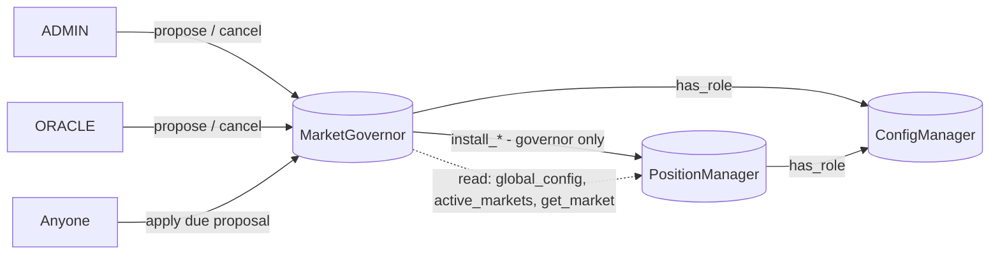

# Plan: split governance out of the PositionManager

**Goal:** get the PositionManager (PM) under the 131,072-byte contract-size cap that testnet and mainnet enforce (THREAT_MODEL T-00), with enough headroom that audit fixes don't push it back over. No product features are removed beyond those already cut (increase, referral).

**Status:** implemented in `b03a55d`…`af8fe56`. The sections below are the plan as written; numbers were measured on a prototype of `b42e5fe`.

**Outcome:** PositionManager 120,727 bytes (10,345 headroom), MarketGovernor 38,543. 164 tests pass.

**Where the implementation deviated from the plan:**
- The checks spanning the market set (market count, hard-cap sum) stay in the PM and run on every install, instead of moving to the governor. They bound the LP-snapshot loop and the solvency caps, so a compromised governor must not be able to skip them. The governor runs the per-config check early at propose time; both use `shared::validation`.
- `install_*` and `deregister_market` take the triggering `actor`, so config events keep naming a person rather than the governor.
- §5.1: binaryen `wasm-opt -Oz` (pinned to 133) saved 5.5 KB on its own; `opt-level = "s"` was worse. Three ledger-total views (`pending_receiver_funding_total`, `protocol_claimable_total`, `unclaimed_payout_total`) joined `pending_fees` as test-only, since only the conservation tests call them.
- Also added: `rust-toolchain.toml` (rustc 1.98.1) for reproducible hashes, and a contracts CI workflow.

## 1. Measured sizes

PM optimized WASM, against a cap of 131,072 bytes:

| Variant | Size | Headroom |
|---|---|---|
| Today (`b42e5fe`) | 134,540 | −3,468 (cannot deploy) |
| A. Governance split | 128,123 | 2,949 |
| B. A + drop the `pending_fees` view from the release build | 126,381 | 4,691 |
| C. B + drop event schemas from the deployed ABI | **119,136** | **11,936** |

Moving validation out of the PM as well saved only 458 bytes, because the constructor still needs it, so validation stays (see §3.3).

**Decision: variant B.** The full ABI, including event schemas, stays on chain so users, explorers and third-party indexers can decode events without our bindings. Variant C was rejected for that reason (§5).

B leaves only 4.7 KB of headroom, about one or two audit fixes. So the plan includes finding **≈5 KB more** in code before the audit (§5.1), for a target of ≥ 10 KB of headroom.

## 2. The seam

Governance is admin-only, cold-path code that is already mostly isolated (`governance.rs`, the propose/apply/cancel entry points in `contract.rs`, the pending-proposal storage, three events). The hot path only needs the *current* config, so the PM keeps a copy of the config and the new contract owns *changing* it.



### 2.1 Moves to `MarketGovernor` (new crate `contracts/market-governor`)

| Moves | Today in PM |
|---|---|
| `propose_/apply_/cancel_global_config` | `contract.rs` |
| `propose_/apply_/cancel_market_config` | `contract.rs` |
| `propose_/apply_/cancel_price_feed` | `contract.rs` |
| Timelock, expiry window and conservative-change predicates | `governance.rs` |
| Checks that span the market set (`max_active_markets`, `hard_cap_factor_sum`) | `contract.rs`, `risk.rs` |
| Pending proposal storage (`PendingGlobalConfig`, `PendingMarketConfig(sym)`, `PendingPriceFeed`) | `storage.rs` (instance) |
| Events `ConfigProposed`, `PriceFeedProposed`, `ProposalCancelled` | `events/` |
| `deregister_market` entry point (ADMIN), which forwards to the PM | `contract.rs` |

### 2.2 Stays in the PM

| Stays | Why |
|---|---|
| Live `GlobalConfig`, each `Market.config`, the price-feed address | Read on every settlement. A cross-contract read per settle would cost CPU and add a trust hop on the hot path. |
| `validate_global` / `validate_market` (per-config sanity checks) | Defense in depth: a compromised governor still can't install a config that breaks PM maths. It costs 458 bytes, and the constructor needs it anyway. |
| `apply_global` / `apply_market`, renamed into `install_*` | Installing a config accrues borrow and funding under the old config and refreshes the borrow rate, which is ledger work. The "risk factor can only change on an empty market" check depends on PM state. |
| `disable_market` / `enable_market` (PAUSER/UNPAUSER) | An emergency action whose flag is read on the hot path |
| Upgrade timelock reading `config_timelock_seconds` | Unchanged; the vault and router also read it through `PM.global_config()` |

### 2.3 New PM entry points (governor only)

```rust
fn install_global_config(env, caller: Address, config: GlobalConfig);
fn install_market_config(env, caller: Address, market_symbol: Symbol, config: MarketConfig);
fn install_price_feed(env, caller: Address, price_feed: Address);   // keeps the decimals check
fn deregister_market(env, caller: Address, market_symbol: Symbol);   // was ADMIN, now governor
```

All four use `require_governor`: `caller.require_auth()` and `caller == stored governor`. This is the same pattern as `require_vault`. The PM emits `GlobalConfigUpdated`, `MarketConfigUpdated` and `PriceFeedChanged` at the point where state actually changes.

### 2.4 `MarketGovernor` interface

Same names and semantics as today, so behaviour is preserved:

```rust
fn __constructor(env, config_manager: Address, position_manager: Address);
fn propose_global_config(env, caller, config);       // ADMIN; conservative -> install now
fn apply_global_config(env, caller);                 // anyone, once due, within the window
fn cancel_global_config(env, caller);                // ADMIN
fn propose_market_config(env, caller, market_symbol, config);  // ADMIN; new market -> install now
fn apply_market_config(env, caller, market_symbol);
fn cancel_market_config(env, caller, market_symbol);
fn propose_price_feed(env, caller, price_feed);      // ORACLE
fn apply_price_feed(env, caller);
fn cancel_price_feed(env, caller);                   // ORACLE or ADMIN (fixes T-07)
fn deregister_market(env, caller, market_symbol);    // ADMIN
fn propose_upgrade / cancel_upgrade / upgrade / migrate   // TimelockedUpgradeable
```

Getters are optional: proposals are visible through events and instance storage. Skip them unless the frontend needs them.

## 3. Security design

These are the points the audit will press on.

1. **The governor's upgrade delay must be at least `config_timelock_seconds`.** Otherwise, upgrading the governor is a way to install config with no timelock. Use the vault's formula: `max(CM.get_upgrade_timelock(), PM.global_config().config_timelock_seconds)`.
2. **The PM's governor address is immutable.** Set it in the constructor; there is no setter. The governor is upgradeable in place, so its address never needs to change.
3. **Per-config validation stays in the PM** (see §2.2). Checks that span the market set live only in the governor, because they need the whole set and are about policy, not safety.
4. **Wiring with no one-shot setter.** Soroban contract addresses are deterministic (deployer + salt). The deploy script derives the governor's address first, deploys the PM with it, then deploys the governor at that salt with the PM's address. This closes T-15 for this pair. Fallback if that is awkward: a one-shot `set_position_manager` on the governor, matching `set_vault`.
5. **Initial config.** The PM constructor still takes and validates `GlobalConfig`, so there is no unconfigured window. Markets are registered through the governor after deploy; a new market installs immediately, as today.
6. **Decision needed (T-04):** re-registering a previously deregistered market currently skips the timelock. The split is a cheap moment to make re-registration timelocked like any other change. I recommend doing it.
7. **New trust boundary for the threat model:** governor compromise = config compromise. It is bounded by PM validation, but fees, margins and caps can be set to any valid value. Add a STRIDE section and update E-1…E-5.

## 4. `pending_fees`

The view is 1,742 bytes, only previews state, and is used by 13 test assertions (`spec_funding`, `spec_e2e`, `spec_adl`, `governance_and_pause`).

- **Recommended:** move it into a separate `#[cfg(feature = "testutils")] #[contractimpl]` block. Tests keep it; the release WASM drops it. Off-chain previews already come from `@win-trader/protocol-math`.
- **Check first:** whether `offchain` or `app` call `pending_fees` through the bindings. If they do, they need a TS replacement before mainnet.

## 5. Event schemas stay on chain (variant C rejected)

Removing the `event_v0` entries from the deployed ABI would have saved 7.7 KB. Our own indexer would not have noticed, because it decodes with the schemas from `@win-trader/bindings` (`offchain/packages/indexer/src/index.ts`, `buildContractSpecMaps`). But anyone reading the ABI from the chain — explorers, the CLI, third-party indexers, users' own tooling — would lose field names. Events are part of the public interface, so the schemas stay.

### 5.1 Finding the remaining ≈5 KB

These are candidates, in the order I'd measure them. Each is measured on its own before anything is adopted.

| Candidate | Expected | Cost |
|---|---|---|
| Stronger post-link optimization: `wasm-opt -Oz --converge` and related passes, on top of `stellar contract optimize` | 1–4 KB (unmeasured; `wasm-opt`/binaryen isn't installed here) | Build tooling only, no code change. The build must stay reproducible for auditors. |
| `opt-level = "s"` versus `"z"`; `codegen-units = 1` is already set | ±1–2 KB, either direction | None |
| Generic conversion code (39% of the code before optimization is SDK `Val` conversion): find types converted in many places and convert once | 1–3 KB | Small refactors |
| Move market disable/enable into the governor, so the PM keeps only the flag read | < 1 KB | Another governor-only entry point |
| Remove read views that only expose a single storage value or ledger total (for example `pending_receiver_funding_total`, `unclaimed_payout_total`) | ~0.3 KB each | Clients read the storage entry directly instead. Only for views no frontend uses. |

If these fall short, the next real lever is a second split: move LP accounting (`prepare_lp_snapshot` / `accounting_snapshot`, ≈3–4 KB) toward the vault. That adds cross-contract reads during LP settlement, so it is a last resort.

## 6. Work plan

Each phase ends green: `cargo test --workspace` passes and the PM size is reported.

| # | Phase | Contents |
|---|---|---|
| 0 | Size guard | `scripts/check-sizes.sh` fails if any optimized contract is over 131,072 bytes and warns below 10 KB of headroom; wire it into `make optimize` and CI. Lands first so the rest can't regress. |
| 1 | `pending_fees` test-only | §4. Expect about −1.7 KB. |
| 2 | Governor crate | New `contracts/market-governor`: move `governance.rs`, the set-level checks and pending storage, plus its own errors and events. Add `MarketGovernorClient` to `shared`. |
| 3 | PM cut-over | Add the `install_*` entry points, governor in the constructor, delete the moved code (§2.1). |
| 4 | Tests | Harness deploys the governor and routes config through it. About 48 call sites across `review_findings`, `governance_and_pause`, `spec_authority`, `spec_e2e`, `spec_adl`, `threat_model`, `common`, `spec_harness`. Add tests for: install refused for non-governor callers; governor upgrade delay ≥ config timelock; PM validation rejects a bad config even from the governor; re-registration timelocked (if §3.6 is accepted). |
| 5 | Extra headroom | Measure the §5.1 candidates one at a time; adopt until headroom is ≥ 10 KB. |
| 6 | Tooling | Derived-address deploy in `deploy.sh` with a wiring check; `add-market.sh` and the config paths go through the governor; add the governor to `upgrade.sh`; add a `governor` key to `addresses.json` and `@win-trader/config` (minor version bump); generate governor bindings from the WASM (fixing T-23 at the same time). Coordinate the `offchain` indexer update: drop the oracle-router binding and the increase/referral handlers, add a governor handler. |
| 7 | Verify and document | Run the full local deploy end to end on quickstart with `--limits unlimited` (see §7), and measure upload cost against the real 400M budget. Update `THREAT_MODEL.md` (T-00 status, new trust boundary, drop referral findings S-6/T-17) and the design spec's governance sections. |

**Rough effort:** 1.5–2.5 days, mostly in phases 3, 4 and 6. Phase 2 is mostly moving code.

**Expected end state:** PM ≈ 126 KB after phases 1–4, ≈ 121 KB once §5.1 lands. Governor estimated at 30–40 KB, in line with the ConfigManager's 31 KB.

## 7. Related fixes to include

- `docker-compose.yml`: run quickstart with `--limits unlimited`. Its presets, `--limits testnet` included, allow 100M instructions per transaction against the real 400M, so the PositionManager upload fails locally even though it fits on testnet and mainnet. *(Corrected during implementation: the plan originally said `--limits testnet`.)*
- T-07 (price-feed cancel) and T-04 (re-registration timelock) are cheap here; see §2.4 and §3.6.

## 8. Decisions needed before starting

1. ~~Variant C or B?~~ **B** — event schemas stay on chain.
2. `pending_fees`: test-only (recommended) or keep in the release build?
3. Timelock re-registration of a deregistered market (T-04)?
4. Derived-address wiring, or a one-shot setter?
