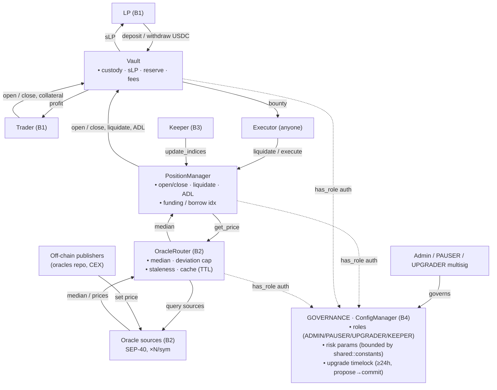

# STRIDE Threat Model — win-trader contracts

> Methodology: Stellar's [Threat Modeling guide](https://developers.stellar.org/docs/build/security-docs/threat-modeling)
> (the "four questions" framing + STRIDE enumeration).
> Scope: the on-chain Soroban contracts in this repo (`Vault`, `PositionManager`,
> `ConfigManager`, `OracleRouter`, and the per-symbol `Oracle` source contracts).
> Off-chain components (indexer, keeper, oracle publishers, API/frontend) appear
> only as external actors / trust boundaries; they have their own models.
>
> Status: **draft** · Last updated: 2026-06-29

---

## 1. What are we working on?

### 1.1 System description

win-trader is a perpetual-futures DEX on Stellar/Soroban. Liquidity providers
(LPs) deposit USDC into a single **Vault**; traders open leveraged long/short
positions against that pooled liquidity (vAMM-style, the LP pool is the
counterparty). Five on-chain contracts cooperate:

| Contract | Role | Trust level |
|---|---|---|
| **ConfigManager** | Source of truth for **roles** (ADMIN / PAUSER / UPGRADER / KEEPER) and all tunable risk parameters; owns the upgrade timelock and two-step admin transfer. Other contracts call it to authorize privileged actions. | Governance-controlled |
| **Vault** | Custodies all USDC; mints/burns `sLP` LP shares; reserves liquidity for open interest; pays trader profit; absorbs trader losses + fees; holds unclaimed protocol fees. | Holds all funds |
| **PositionManager** | Opens/increases, decreases/closes, liquidates, and auto-deleverages (ADL) positions; computes PnL, borrow & funding indices; enforces leverage, margin, and liquidation thresholds. | Holds position state |
| **OracleRouter** | Aggregates multiple per-symbol price sources into a deviation/staleness-checked **median**; caches it; serves `get_price` to PositionManager. | Price integrity |
| **Oracle** (per source) | SEP-40 price feed contracts written by off-chain publishers (CEX feeds from the `oracles` repo). Multiple per symbol. | **Semi-trusted** input |

`shared` and `interfaces` are library crates (constants, types, traits) — they
compile into the deployed contracts and are not separately deployed.

### 1.2 External actors

| Actor | Trusted? | What they can do |
|---|---|---|
| **LP** | Untrusted | `deposit` / `mint` / `withdraw` / `redeem` USDC ↔ `sLP` shares. |
| **Trader** | Untrusted | `increase_position`, `decrease_position`, `set_tp_sl`; deposits collateral. |
| **Executor** (anyone) | Untrusted | Permissionless `liquidate_position`, `execute_order` (TP/SL), `deleverage_position` — paid a bounty from the closed position, never from LP capital. |
| **Keeper** (KEEPER role) | Semi-trusted | `update_indices` (borrow/funding accrual). Off-chain bot in the `offchain` repo. |
| **Oracle publisher** | Semi-trusted | Writes prices into the per-symbol SEP-40 `Oracle` source contracts (off-chain, `oracles` repo). |
| **Admin / governance** | Trusted, bounded | Grants roles, sets risk parameters within hard-coded ceilings, proposes upgrades (24h timelock). |
| **USDC token (SAC)** | Trusted | Standard Stellar Asset Contract; assumed to behave per the token interface. |

### 1.3 Assets (what we protect)

1. **LP capital** — pooled USDC in the Vault (the largest at-risk balance).
2. **Trader collateral** and open-position value.
3. **Protocol solvency invariant** — Vault assets ≥ liabilities (LP claims +
   open-trader PnL liability + unclaimed fees).
4. **Price integrity** — the median price `PositionManager` settles against.
5. **Unclaimed protocol fees** (dev/staker accruals).
6. **Privilege state** — role assignments and the admin key.
7. **Code integrity** — the WASM behind each contract (upgrade path).

### 1.4 Trust boundaries

- **B1 — User ↔ contracts.** LPs/traders/executors are fully untrusted. Every
  entrypoint they reach requires `require_auth` on the acting address and
  validates all inputs.
- **B2 — Off-chain ↔ on-chain (oracle).** The chain cannot verify CEX prices;
  it trusts the *aggregate* of ≥`min_required_sources` SEP-40 feeds, defended by
  median + one-sided deviation cap + staleness filter, not any single source.
- **B3 — Keeper boundary.** Index updates are driven by an off-chain KEEPER bot;
  the contracts must remain correct (and bad debt resolvable) even if the keeper
  is offline, delayed, or reordered.
- **B4 — Governance boundary.** ADMIN/PAUSER/UPGRADER are trusted but bounded:
  parameter ceilings live in `shared::constants` and move only via upgrade; the
  upgrade itself is gated by a ≥24h timelock with a PAUSER veto; admin transfer
  is two-step.
- **B5 — Inter-contract.** Vault, PositionManager, and OracleRouter authorize
  privileged calls by cross-calling `ConfigManager.has_role`; addresses are
  wired at initialization. A compromised/mis-wired peer is a boundary concern.

### 1.5 Data flow diagram

*Trust boundaries B1–B5 are defined in §1.4. Dotted edges are `ConfigManager.has_role` authorization lookups, not value/data flow.*

### 1.6 Assumptions

- The USDC SAC and the SEP-40 oracle interface behave per spec (no malicious
  token re-entrancy beyond the standard interface; no lying `decimals`).
- The Soroban host enforces `require_auth` correctly and isolates contract
  storage.
- `overflow-checks` is enabled for release builds (see Tamper.5 / verification).
- The admin key is a multisig under honest-majority control; a fully malicious
  admin is out of scope for *theft prevention* but in scope for *blast-radius
  limitation* (timelock, ceilings, veto).
- At least `min_required_sources` (≥2) honest, live oracle sources exist per
  active market.

---

## 2. What can go wrong?

Threats are enumerated per STRIDE category. Each row lists the threat, the
affected component, the control already in the code (with `file:line`), and the
**residual** risk *after* that control. Treatments and open items are
consolidated in §3; verification in §4.

Severity key (residual, post-control): 🟢 Low · 🟡 Medium · 🔴 High.

### 2.1 Spoofing — *acting as someone/something you are not*

| ID | Threat (component) | Control in place | Residual |
|---|---|---|---|
| **Spoof.1** | Attacker submits a trade/withdrawal as another user to move their funds (PositionManager, Vault). | Every user entrypoint authenticates the acting address: `trader.require_auth()` on `increase`/`decrease`/`set_tp_sl` (`position-manager/src/contract.rs:76,102,153`); `operator.require_auth()` + `operator == from == receiver` on `deposit`/`mint`/`withdraw`/`redeem` (`vault/src/contract.rs:100-106`). Host enforces signatures. | 🟢 |
| **Spoof.2** | A rogue contract impersonates `PositionManager` to call the Vault's privileged settlement entrypoints (`pay_profit`, `reserve_liquidity`, `accrue_fees`, `claim_fees_to`) and drain LP funds. | `require_position_manager()` checks `caller == stored PM address` **and** `require_auth`; PM address is bound in the Vault constructor and is **immutable** (`vault/src/logic.rs:141-146`, `vault/src/contract.rs:238-254`). | 🟢 |
| **Spoof.3** | A fake/rogue oracle *source* reports a spoofed price to skew the mark. | OracleRouter only queries the admin-curated per-symbol source list; each `Oracle.set_price` requires the **per-instance publisher's** auth (`oracle/src/contract.rs:27,100-104`); router takes a **median** over ≥ `min_required_sources` (floor 2) and rejects pools whose one-sided spread exceeds `max_deviation_bps` (`oracle-router/src/logic.rs:148-179`). A single rogue source cannot move the median past the deviation cap. | 🟡 (quorum collusion / admin-added source — see Elev.2) |
| **Spoof.4** | Attacker calls keeper-only `update_indices` / `deleverage_position` posing as the keeper. | `require_keeper` → `ConfigManager.has_role(KEEPER)` + `require_auth` (`position-manager/src/guards.rs:39-45`, `contract.rs:122,161`). | 🟢 |
| **Spoof.5** | Attacker poses as ADMIN to reconfigure the protocol. | `require_admin_with_auth` over OZ AccessControl; two-step admin transfer (`propose_admin`→`accept_admin`, 7-day TTL) prevents hijack/typo-bricking (`config-manager/src/contract.rs:143-336`). | 🟢 (assumes admin-key custody, §1.6) |

### 2.2 Tampering — *unauthorized modification of state, price, or value*

| ID | Threat (component) | Control in place | Residual |
|---|---|---|---|
| **Tamper.1** | Oracle price tampering to mis-mark positions — force liquidations, inflate PnL, spuriously (un)trigger TP/SL. | Median + one-sided deviation cap (`PriceDeviationTooHigh`), per-source staleness filter, future-timestamp rejection, non-positive rejection, `min_required_sources`, `decimals()` pinned to 7 at config time, cache versioned & invalidated on config change (`oracle-router/src/logic.rs:78-179`, `contract.rs:38-71`). | 🟡 (oracle is the central trust; PM does no extra age-check — `tick.rs:157-160`) |
| **Tamper.2** | Reentrancy via a token transfer callback to corrupt mid-flow state. | Checks-effects-interactions: `increase_position` validates everything, then pulls collateral+fee+escrow in **one** transfer at the end (`increase.rs:177-178`); `withdraw` burns shares before transferring; Soroban rolls back the whole tx on panic. Standard USDC SAC exposes no transfer hooks. No explicit reentrancy mutex. | 🟢 (valid only under the standard-SAC assumption, §1.6) |
| **Tamper.3** | Rounding/precision abuse to extract dust or under-pay fees. | Division floors consistently **toward the pool**; share conversions floor on mint (`assets_to_shares`) and ceil on burn (`shares_to_assets`) — both favor the vault/remaining LPs (`vault/src/logic.rs:205-227`); explicit `Rounding::Floor`/`Ceil` via `mul_div_i128`. | 🟢 (index-truncation accumulation flagged for audit — §3) |
| **Tamper.4** | First-depositor / share-price **inflation** attack (donate to vault, then steal a later depositor's deposit). | Virtual-offset share basis `(supply + 1e6, lp_assets + 1)` (`vault/src/logic.rs:196`). | 🟢 |
| **Tamper.5** | Integer overflow/underflow corrupts balances or indices. | `overflow-checks = true` in release (panics → rollback; confirmed `Cargo.toml:27`); `checked_mul/add/sub` on leverage, deviation, median, and funding (with progressive-halving fallback); `slope2`/borrow-rate ceilings bound index growth (`position-manager/src/math.rs:77-95,138-140`; `oracle-router/src/logic.rs:261-294`). | 🟢 |
| **Tamper.6** | LP withdraws against a **stale net-PnL** snapshot to exit before open-trader gains are booked into liabilities. | `require_fresh_pnl_sync` gates `withdraw`/`redeem` on a full-book PnL sync < 900 s old whenever positions are open; LP-fair basis subtracts `max(0, net_pnl)` (`vault/src/logic.rs:13,121-135,184`). | 🟡 (freshness window) |
| **Tamper.7** | Manipulating the pause window so borrow/funding fees retroactively accrue (or are skipped). | Pause is idempotent and preserves `last_pause_time`; next index update clamps `effective_start = max(last_index_update, last_unpause)` so fees don't accrue across the pause (`position-manager/src/tick.rs:59-101`, `contract.rs:185-203`). | 🟢 |
| **Tamper.8** | Re-point PM at a malicious Vault (or vice-versa) to redirect settlement. | `set_vault` is one-shot (`AlreadyInitialized`, `position-manager/src/contract.rs:51-58`); Vault's PM binding is constructor-immutable. | 🟢 (trust in initial deploy wiring) |

### 2.3 Repudiation — *denying an action that happened*

| ID | Threat (component) | Control in place | Residual |
|---|---|---|---|
| **Repudiate.1** | An actor denies a trade, liquidation, fee, role change, or upgrade. | All state-changing entrypoints emit events (trades/closes/liquidations, `FeeAccrualClamped`, pause, role grants, `UpgradeProposed`/executed, config updates); `require_auth` binds each action to a signature; ledger is immutable. The off-chain indexer is built on these events. | 🟢 |
| **Repudiate.2** | PM misreports a loss settlement, disputing how much collateral was absorbed. | `record_absorbed_collateral` verifies the **observed** token-balance delta `post - pre == amount` (`vault/src/contract.rs:361`); realized vs unrealized PnL tracked separately. (Design: ADR-0001 — losses settle by a direct PM→Vault transfer, not `pay_profit`.) | 🟢 |
| **Repudiate.3** | An oracle publisher disputes a price it pushed. | `set_price` requires publisher auth and stamps `last_update`; per-instance publisher binding attributes each price to one key (`oracle/src/contract.rs:27-36`). | 🟢 (real-world identity attribution is off-chain) |

### 2.4 Information Disclosure — *exposing data*

| ID | Threat (component) | Control in place | Residual |
|---|---|---|---|
| **Info.1** | All positions, LP balances, lockups, and PnL are world-readable (`get_position`, `net_global_trader_pnl`, `lockup_expires_at`, …). | Inherent to a public ledger — **accepted by design**. No secrets/keys are stored on-chain; contracts hold only addresses and economic state. | 🟢 (accepted) |
| **Info.2** | Public liquidation/TP-SL state lets searchers front-run keepers (MEV). | Treated as an *incentive*, not a leak: liquidation/`execute_order` are permissionless and bountied, so competition is the intended outcome (`position-manager/src/contract.rs:108,142`). | 🟡 (MEV inherent to on-chain perps) |
| **Info.3** | Mempool observation of a pending trade enables sandwiching around oracle latency. | `min_position_lifetime` blocks close-right-after-open; trader-set `acceptable_price` slippage bound; utilization gate uses PnL-excluded `safe_basis` so an oracle wick can't bias it (`increase.rs:165-172`, `close.rs:44-63`). | 🟡 |
| **Info.4** | Secrets/PII leakage. | None stored on-chain by design. | 🟢 (none) |

### 2.5 Denial of Service — *making the system unusable or stuck*

| ID | Threat (component) | Control in place | Residual |
|---|---|---|---|
| **DoS.1** | Oracle outage / quorum loss: `get_price` reverts, so opens **and** closes/liquidations revert — bad debt can't be cleared while the feed is down. | **Fail-closed** (no mis-settlement on a bad price); PAUSER + per-market `disable_market` to wind a bad-oracle market down while leaving closes open (`risk-parameters.md §6`). | 🟡 (liveness depends on the feed) |
| **DoS.2** | Funding-pool exhaustion leaves funding *receivers* unpaid. | Zero-sum-by-design: receiver claims are capped at the pool balance so the pool can never go negative (`position-manager/src/tick.rs:208-216`). | 🟢 (by design; dormant-pool TTL edge flagged — §3) |
| **DoS.3** | Storage/TTL griefing: permissionless `bump_position` keeps positions/markets alive (rent); unbounded market registry makes `sync_all_unrealized_pnl` O(n). | `bump_*` is a no-op if the key is absent; positions are deleted on full close; cooldown bounded by the slot TTL; markets are only created by ADMIN (`set_max_leverage`). | 🟡 (recommend registry-size monitoring/soft cap — §3) |
| **DoS.4** | A dormant contract's **instance storage** archives and bricks the protocol. | Every entrypoint bumps instance TTL; permissionless `bump_*_state` lets anyone keep each contract's instance alive (`vault/src/contract.rs:514`, `position-manager/src/contract.rs:166`). | 🟢 |
| **DoS.5** | Admin/PAUSER pauses the protocol to deny service. | Bounded: `decrease`/`liquidate`/`deleverage`/`execute_order` deliberately **bypass** pause, so traders can always de-risk and bad debt stays resolvable (`risk-parameters.md §10`). | 🟡 (governance trust — see Elev.2) |
| **DoS.6** | Loop/gas griefing in price aggregation. | Source pool capped at `MAX_ORACLE_SOURCES = 16` (`oracle-router`); median is O(n log n) over ≤16. | 🟢 |

### 2.6 Elevation of Privilege — *gaining rights you should not have*

| ID | Threat (component) | Control in place | Residual |
|---|---|---|---|
| **Elevation.1** | A trader/LP escalates to a privileged role. | All privileged calls check `ConfigManager.has_role`; `grant_role`/`revoke_role` are ADMIN-only and **refuse to grant/revoke the ADMIN role** through that path (`config-manager/src/contract.rs:143-163`). No user entrypoint mutates roles. | 🟢 |
| **Elevation.2** | A compromised/malicious **ADMIN** abuses parameter power: max borrow rate, 10% liquidation bounty, tightened thresholds, **adding a malicious oracle source**, or changing `max_leverage`. | Hard ceilings/floors in `shared/src/constants.rs` bound every parameter (move only via upgrade): ADL floor `MIN_ADL_PNL_BPS=5000` blocks continuous-ADL configs, liq-threshold cap 10%, deviation ceiling 100%, bounty cap 10%, etc. **But parameter changes are *not* timelocked** (only WASM upgrades are) — an admin can change economics, or add/remove an oracle source, in a single tx within the ceilings. | 🔴 (governance; mitigate with multisig + monitoring + param-timelock — §3) |
| **Elevation.3** | A malicious WASM **upgrade** installs arbitrary fund-draining logic. | UPGRADER proposes; ≥24 h timelock captured **at propose time** (can't be shortened for an in-flight proposal); committed `wasm_hash` is re-checked at execute (no substitution); **PAUSER veto** via `cancel_upgrade` (`interfaces/src/upgrade.rs:84-122`; floor `MIN_UPGRADE_TIMELOCK=86_400`, ceiling 30 d). | 🟡 (blast radius bounded by 24 h + veto) |
| **Elevation.4** | **ConfigManager is the single root of trust** — compromising its ADMIN cascades to roles, parameters, and (via add-source) the oracle on all four contracts. | Two-step admin transfer; OZ AccessControl; ADMIN ungrantable via `grant_role`. | 🔴 (crown-jewel key — §3) |
| **Elevation.5** | A compromised **KEEPER** griefs via spurious ADL or index manipulation. | `deleverage_position` only closes **profitable** positions, pays **no** executor reward, and fires only when `adl_pnl`/`adl_utilization` triggers are met (`position-manager/src/close.rs:207-225`); role is revocable. `update_indices` only accrues fees. | 🟡 |
| **Elevation.6** | Abuse of the **permissionless** `liquidate_position` / `execute_order`. | Intended economic feature: `liquidate` requires `effective_health < collateral·liq_threshold/BPS`; `execute_order` requires the TP/SL trigger; the bounty is funded **only** from the trader's absorbed collateral, never LP capital; gate and settlement read `effective_health`/price from the **same** evaluation, preventing drift (`close.rs:119-174,256-306`). | 🟢 |

---

## 3. What are we going to do about it?

### 3.1 Controls already in place (summary)

- **AuthN/AuthZ:** `require_auth` on every user action; role checks centralized in
  ConfigManager; PM↔Vault bindings immutable; two-step admin transfer.
- **Oracle defense-in-depth:** multi-source median, deviation cap, staleness +
  future-timestamp + non-positive filters, quorum floor (2), pinned decimals,
  versioned cache. Fail-closed on bad/missing price.
- **Arithmetic safety:** `overflow-checks = true`; checked math on all
  growth/overflow-prone paths; rounding always toward the pool; virtual-offset
  share basis.
- **Solvency invariants:** `reserved + unclaimed_fees ≤ total_assets`;
  free-liquidity gate on withdrawals; fresh-PnL gate on LP exits; balance-delta
  verification on loss settlement; zero-sum funding capped at the pool.
- **Upgrade safety:** ≥24 h timelock (hash-committed, propose-time-captured) with
  PAUSER veto, on all four contracts.
- **Kill-switches:** independent Vault/PM pause + per-market disable; close paths
  always bypass pause.
- **Parameter sanity:** hard ceilings/floors compiled into `shared::constants`.

### 3.2 Open items / recommended treatments (prioritized)

| # | Treatment | Addresses | Priority |
|---|---|---|---|
| T1 | Hold ADMIN/UPGRADER/PAUSER as a **multisig**, with PAUSER on an **independent** key from UPGRADER (so the veto survives an upgrader compromise). Document key custody. | Elev.2/3/4, Spoof.5, DoS.5 | **High** |
| T2 | Add a **timelock (or multisig-with-delay) to the most sensitive parameter changes** — oracle source list, `FeeConfig`, `max_leverage` — since today only WASM upgrades are timelocked. | Elev.2, Spoof.3, Tamper.1 | **High** |
| T3 | **Off-chain monitoring & alerting** on `ConfigUpdate`/role-grant/`UpgradeProposed` events, oracle deviation rejections, source freshness, and quorum margin. | Elev.2/3, Tamper.1, DoS.1 | **High** |
| T4 | Deploy-time checklist: **`set_oracle_config` must be called before first `get_price`** (OracleConfig is *not* seeded by `initialize`; first read otherwise panics `NotInitialized`). Keep sources ≥ `min_required_sources + buffer` per active market. | DoS.1, Tamper.1 | **High** |
| T5 | Bound/monitor **market-registry size** (soft cap) since `sync_all_unrealized_pnl` is O(n); document the permissionless `bump_position` storage-rent consideration. | DoS.3 | Medium |
| T6 | External **deep-audit focus areas**: index-truncation accumulation over multi-year horizons; the dormant-market `FundingPool` TTL-expiry edge (pool archives while market lives). | Tamper.3, DoS.2 | Medium |
| T7 | Treat **"asset = standard non-rebasing, hook-free SAC"** as a hard invariant; re-review Tamper.2 if the collateral token ever changes. | Tamper.2 | Medium |
| T8 | Independent **security audit + bug bounty** before mainnet; re-run this threat model on every upgrade. (ADR-0001 notes a prior audit validated the loss-settlement pattern — confirm its scope.) | All 🔴/🟡 | **High** |

---

## 4. Did we do a good job?

### 4.1 Test evidence

`cargo test --workspace` → **949 passing, 0 failing** (785 unit + 154 integration),
plus proptest **fuzz** targets (`position_fuzz`, `vault_fuzz`,
`integrated_drift_fuzz`) with checked-in regression seeds, and **snapshot** tests
asserting token-conservation and solvency-boundary behavior.

Controls in §2 have targeted coverage, e.g.:

| Threat area | Representative tests |
|---|---|
| Oracle (Tamper.1, Spoof.3, DoS.1) | router tests for `StalePrice`, `InsufficientSources`, `PriceDeviationTooHigh`, `DeviationOverflow`, exact-boundary deviation |
| Upgrade timelock (Elevation.3) | `test_upgrade_timelock_enforcement` on all four contracts; `test_propose_upgrade`, `test_upgrade_timelock` |
| Roles/admin (Elevation.1/4, Spoof.5) | `test_grant_role`, `test_revoke_role`, `test_role_lifecycle`, `test_admin_split_brain`, `test_admin_transfer` |
| Solvency/LP (Tamper.3/4/6) | `test_lp_basis`, `test_lockup_expires_at`, `test_fee_splits`, `accrue_fees` clamp + token-conservation snapshots |
| Liquidation/ADL (Elevation.5/6, DoS.2) | `test_liquidate`, `test_liquidation_threshold`, `test_adl`, drift solvency-boundary snapshots |
| Config bounds (Elevation.2) | `test_protocol_limits`, `test_bounds_tightening`, `test_per_rule_error_codes` |

### 4.2 Model validation

- The entrypoint/authorization inventory in §1–§2 was derived directly from the
  source and is `file:line`-cited; the DFD trust boundaries map 1:1 to the
  cross-contract `has_role` / address-check guards.
- At least one issue is enumerated for each STRIDE letter (template requirement),
  with 33 issues total across the six categories.

### 4.3 Residual-risk register

The accepted residual risks after controls are the 🟡/🔴 rows in §2 — dominated
by **governance trust** (Elevation.2/4: un-timelocked parameter power and the
ConfigManager root key) and **oracle trust** (Tamper.1/Spoof.3, DoS.1). T1–T4 and
T8 in §3.2 are the treatments that close or shrink these. This model should be
re-reviewed on every contract upgrade and whenever a new role, market type, or
collateral asset is introduced.

